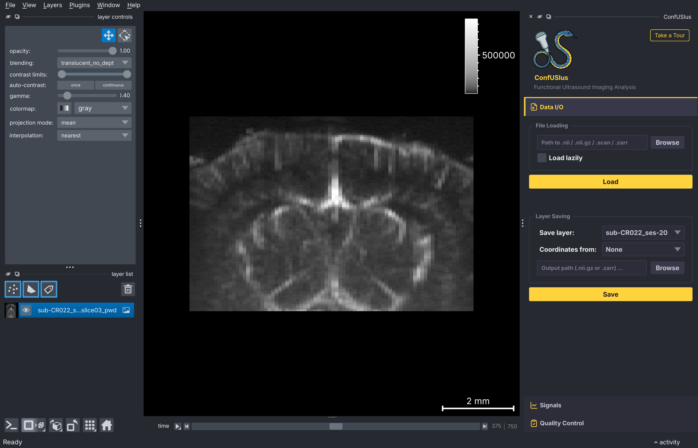
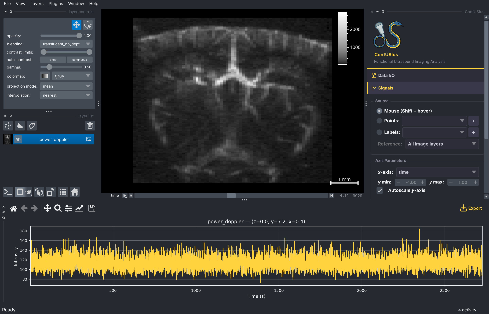
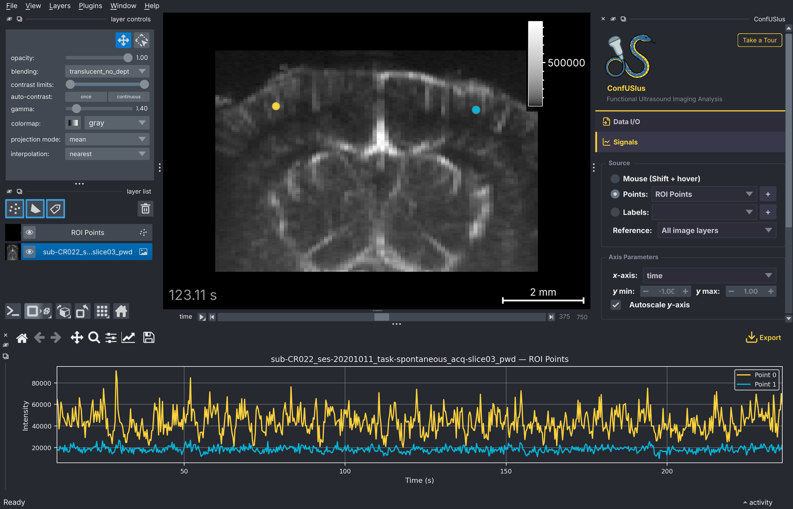
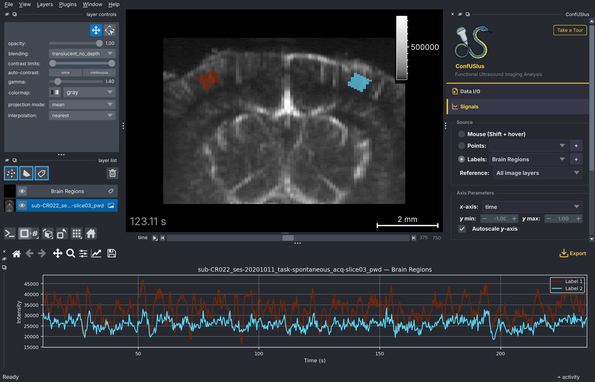
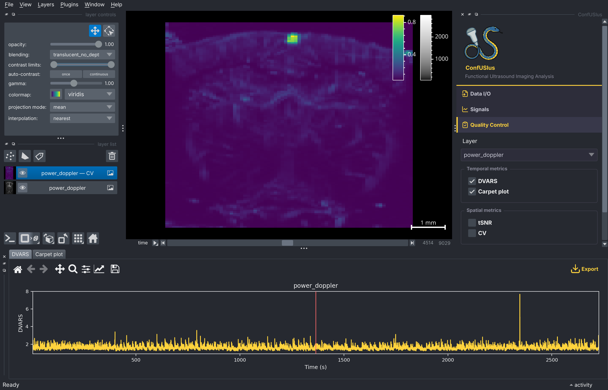

# Using the Plugin

The ConfUSIus sidebar contains five collapsible panels. Each panel operates
independently and can be expanded or collapsed by clicking its header. For an in-app
introduction, click **Take a Tour** in the sidebar header.

- [**Data I/O**](#data-io-panel) — load and save fUSI files (NIfTI, Zarr, SCAN).
- [**Video**](#video-panel) — load videos side-by-side, temporally synced with the fUSI acquisition.
- [**Signals**](#signals-panel) — plot voxel, point, or label-region signals in a bottom dock.
- [**QC**](#qc-panel) — compute DVARS, carpet, CV, tSNR for a selected layer.
- [**Registration**](#registration-panel) — run between-scan or within-scan registration, inspect progress, and save/apply transforms.

## Data I/O Panel

The Data I/O Panel handles both loading and saving fUSI files without leaving the
viewer.



### Loading data

Click **Browse** to pick a file—it loads immediately on selection. Or paste a path
directly in the text field and press ++enter++. Enable **Load lazily** beforehand to
keep the array Dask-backed for large files. A progress bar animates during loading, and
any error is reported in the napari notification bar.

!!! info "Time overlay"
    When a loaded scan contains a time dimension, the current time coordinate is
    displayed as a text overlay in the bottom-left corner of the canvas. The value and
    units are read from the scan's coordinate metadata and update automatically as you
    scrub the time slider.

    When multiple scans are open, the overlay reflects the currently selected layer.
    If zero or more than one layer is selected, it keeps following the previously
    selected one.

### Saving data

1. Select the layer to save from the **Save layer** dropdown.
2. Optionally select a layer in the **Coordinates from** dropdown to borrow its physical
   coordinates and attributes. This is useful when saving a labels layer drawn on top of
   a fUSI image: selecting the image layer as the template preserves the full physical
   coordinate system. If the labels layer has fewer dimensions than the template (e.g. a
   3D labels layer against a 4D image), the trailing spatial dimensions are used
   automatically.
3. Type an output path or click **Browse**. The format is inferred from the extension:
   `.nii` / `.nii.gz` for NIfTI and `.zarr` for Zarr.
4. Click **Save**. A notification confirms success.

Three save modes are applied automatically depending on what is available:

| Mode | When applied |
|------|-------------|
| **Direct** | The layer was loaded via ConfUSIus (DataArray in metadata). Saved verbatim, all coordinates and attributes preserved. |
| **Template** | A template layer is selected. Coordinates are borrowed from the template DataArray. |
| **Reconstruct** | No template and no DataArray in metadata (e.g. a freshly drawn labels layer). Coordinates are reconstructed from the napari layer state (`scale`, `translate`, `axis_labels`). |

## Video Panel

The Video Panel loads one or more videos (`.mp4`, `.mov`, `.avi`) and
overlays them beside a fUSI scan in a synchronized grid. Each video becomes its own
napari Image layer whose time axis is locked to the reference scan, so scrubbing the
time slider plays every video in lockstep with the fUSI recording.

### Loading a video

1. Pick the fUSI image layer to synchronize against in the **Reference layer**
   dropdown. The reference must have ConfUSIus coordinate metadata, so load it
   through the [Data I/O Panel](#data-io-panel) or the [`confusius`
   CLI](overview.md#recommended-data-panel-and-cli) command.
2. Insert a path or click **Browse** to pick a video file.
3. Click **Add video**. The video appears as a new Image layer, grid mode is
   enabled with a single-row layout, and the viewer shows the reference scan and
   the video side by side.

Repeat to add more videos (each will get its own cell). All videos share the
reference layer's axis labels, time index, and dimensionality; their spatial scale
is chosen so the video height matches the fUSI height, with isotropic pixels and
the frame centered on the scan.

!!! tip "Launch with a video from the CLI"
    Pass both a data file and `--video` to open them together:
    ```bash
    confusius path/to/scan.nii.gz --video path/to/camera.mp4
    ```


### Playback


| Option | Description |
|--------|-------------|
| **Frame step** | Show every *N*-th frame of the video. Higher values skip frames for lighter playback of long or high-frame-rate recordings. The effective frame rate becomes `fps / N`. Changes apply to every loaded video. |


!!! tip "Napari playback performance"
    Napari handles animations quite smoothly up to around 30 to 50 FPS (even higher
    depending on user hardware and operating system). Use **Frame step** to reduce the
    effective frame rate if playback is choppy or buffering.

The time scale of each video layer is `frame_step / fps` seconds, so the napari
time slider and the time overlay continue to report physical seconds regardless
of the chosen step.

!!! note "Time axis is kept out of the displayed dims"
    The panel installs a guard that prevents napari from ever placing the time
    axis in the 2D display. If you reorder dimensions such that time would become
    a display dimension, the order is silently corrected.

## Signals Panel

The Signals Panel plots signals extracted from image layers along any non-spatial
dimension (time, lag, feature, etc.). The plot appears in a bottom dock that is created
the first time you click **Show Signal Plot**.

### Choosing a data source

Pick one of three source modes in the **Source** group:

**Mouse**
: Hold ++shift++ and move the mouse over the canvas. The plot updates live with the
  single-voxel signal at the cursor position.



**Points**
: Select a Points layer from the dropdown (or click **+** to create one). Each point
  is plotted as a separate line colored by its face color. Add or remove points in
  napari and the plot updates automatically.



**Labels**
: Select a Labels layer from the dropdown (or click **+** to create one). The mean
  signal is extracted for each distinct non-zero label and plotted as a separate line,
  colored by the label's color in the napari colormap. This is useful for quickly
  comparing region-averaged signals after painting ROIs with napari's brush tool.



In Points and Labels modes, the **Reference** dropdown selects which image layer to
extract signals from. It defaults to **All image layers**, which plots each layer as a
separate line (distinguished by line style).

### Axis parameters

| Option | Description |
|--------|-------------|
| ***x*-axis** | Choose which non-spatial dimension to plot on the horizontal axis. Defaults to `time` when available, otherwise the first non-spatial dimension. |
| ***y* min / *y* max** | Manual limits for the vertical axis (disabled while autoscale is on). |
| **Autoscale *y*-axis** | When enabled, the vertical axis rescales to fit the data automatically. Disabling it captures the current limits so you can fine-tune them. |

### Display options

| Option | Description |
|--------|-------------|
| **Show grid** | Show or hide the background grid. |
| **Show x-axis cursor** | Draw a vertical line on the plot that follows the napari dimension slider for the selected *x*-axis dimension. |
| **Z-score signal** | Normalize each signal to zero mean and unit variance before plotting. The *y*-axis label changes from "Intensity" to "Z-score". |

!!! tip "Click to navigate"
    Left-click anywhere on the signal plot to jump the napari viewer to the
    corresponding time slice. Clicks are ignored while a zoom or pan tool is active
    in the plot toolbar.

### Managing signals

Click **Manage Signals** to open a floating dialog where you can customize both live
signals (from the current source mode) and imported signals:

- **Rename**: Double-click a signal's name to edit it.
- **Recolor**: Click the color swatch to pick a new color. Changes are synced back to
  the napari layer (point face color or label colormap).
- **Show / Hide**: Toggle individual signal visibility with the checkbox.

### Importing and exporting signals

**Import**
: In the Manage Signals dialog, click **Import** to load signals from a CSV or TSV
  file. The file must contain a column whose header matches the current *x*-axis
  dimension name (e.g. `time`) plus one or more numeric value columns. Each value
  column becomes a separate signal overlaid on the plot.

**Export**
: Click the **Export** button in the plot toolbar to export all currently plotted
  signals—both live and imported—to a CSV or TSV file.

## QC Panel

The QC Panel computes quality control metrics for a selected image layer.



Select a layer from the **Layer** dropdown, check the metrics you want, and click
**Compute**.

=== "Temporal metrics"

    Temporal metrics are rendered as plots in the bottom dock (the same dock used by the
    Signals Panel, in separate tabs). Computed plots are cached and survive dock
    closure: closing and reopening the bottom dock restores the last computed result.

    **DVARS**
    : Plots the standardized temporal derivative of variance over time. A vertical cursor
      follows the napari time slider. See [DVARS](../user-guide/quality-control.md#dvars)
      for interpretation.

    **Carpet plot**
    : Displays the full voxel time series as a 2D raster (time × voxels). See [Carpet
      Plot](../user-guide/quality-control.md#carpet-plot) for interpretation.

    !!! tip "Click to navigate"
        Left-click anywhere on a temporal metric plot (DVARS or carpet) to jump the
        napari viewer to the corresponding time slice. Clicks are ignored while a zoom
        or pan tool is active in the plot toolbar.

=== "Spatial metrics"

    Spatial map metrics are added as new image layers in the napari layer list, with
    correct physical scale and origin preserved.

    **CV**
    : Coefficient of variation map.

    **tSNR**
    : Temporal signal-to-noise ratio map.

    !!! warning "Prefer CV over tSNR for fUSI power Doppler data"
        tSNR is misleading for power Doppler: low-signal regions such as gel layers and
        shadow zones behind the skull can appear bright. CV correctly highlights regions
        with high temporal variability. See the [Quality Control
        guide](../user-guide/quality-control.md#temporal-snr) for a full explanation.

## Registration Panel

The Registration Panel runs the ConfUSIus registration workflows directly from napari.
Use **Between scans** for registering different recordings, or **Within-scan** for
volume-wise motion correction within a single recording. The panel supports modifying
registration parameters, live preview, and saving/loading/applying computed transforms.

### Between scans

Use **Between scans** when you want to register one layer onto another, for example two
recordings from different animals or a functional recording onto an angiography.

1. Select the **Moving layer** and **Fixed layer**.
2. Choose a transform model.
3. Optionally choose a **Scale** for to compress the intensity dynamics.
3. Optionally choose an **Initialization** transform if layers are very misaligned.
4. Click **Run registration**.

Available transform models are:

- `translation` for x/y/z-only shifts,
- `rigid` for translations and rotations,
- `affine` for translations, rotations, scaling, and shear,
- `bspline` for non-linear local deformations.

For `bspline`, a staged workflow usually works best: first run `rigid` or `affine`, then
run `bspline` and select the previous transform in **Initialization**. This lets the
B-spline model refine a good global alignment instead of trying to solve both
large-scale and local deformation at once.

#### Main parameters

| Parameter | What it does | When it is useful |
|---|---|---|
| **Transform** | Chooses the motion model being optimized. | Start with `translation` or `rigid` for simple alignment; use `affine` for global scale/shear differences; use `bspline` only after a good global initialization. |
| **Mesh size** | Sets the B-spline control-grid density. | Increase it only when `bspline` needs to capture finer local mismatches; too fine a grid can lead to unrealistic warping. |
| **Metric** | Chooses the similarity criterion (`correlation` or `mattes_mi`). | `correlation` is a good default for power Doppler data; `mattes_mi` is more robust when intensity distributions differ. |
| **Scale** | Applies optional intensity scaling before registration. | Useful for power Doppler data where large vessels are typically overbright compared to finer structures. |
| **Initialization** | Sets the starting transform before optimization. | Use `center_geometry` or `center_moments` for coarse setup; reuse a saved/manual affine transform when you already have a good approximate alignment. |
| **Learning rate** | Sets the optimizer step size. | Lower values are safer but slower; higher values can converge faster but may create instabilities. |
| **Iterations** | Maximum number of optimizer steps. | Increase it when alignment is still improving near the end of a run. |

#### Advanced parameters

| Parameter | What it does | When it is useful |
|---|---|---|
| **Histogram bins** | Number of bins used by `mattes_mi`. | Tune only when using mutual information; more bins can capture finer intensity structure but may be noisier. |
| **Convergence minimum value** | Minimum optimizer improvement required to keep iterating. | Lower it when you want stricter convergence. |
| **Convergence window size** | Number of recent iterations used to test convergence. | Increase it to make convergence detection less sensitive to noise. |
| **Multi-resolution** | Runs registration from coarse to fine scales. | Usually helpful for difficult B-spline alignments or large initial offsets. |
| **Shrink factors** | Downsampling factors for each resolution level. | Use larger coarse levels when the initial mismatch is large. |
| **Smoothing sigmas** | Gaussian smoothing at each resolution level. | Helps emphasize global structure before fine alignment. |
| **Resample interp.** | Interpolation used for the registered output and previews. | `linear` is the usual default; `bspline` can give smoother resampled images. |
| **Fill value** | Value written outside the moving field of view after resampling. | Useful for controlling the appearance of padded background. |

The animation below uses between-session angiography volumes from the same animal across
different days. ConfUSIus keeps the original layers untouched, adds dedicated preview
layers for inspection, and stores the final registered result as a new layer when the
run completes.


### Within-scan

Use **Within-scan** for motion correction inside a single time series.

1. Switch **Mode** to **Within-scan**.
2. Select the time-series **Moving layer**.
3. Choose the **Reference volume** index used as the registration target.
4. Pick a transform model (`translation`, `rigid`, or `affine`).
5. Click **Run registration**.

#### Main parameters

| Parameter | What it does | When it is useful |
|---|---|---|
| **Reference volume** | Chooses the volume index used as the motion-correction target. | Pick a representative, sharp frame with little motion. |
| **Transform** | Chooses the volume-wise motion model. | `rigid` is the safest starting point; `affine` is available when motion is more complex. |
| **Metric** | Chooses the volume-to-reference similarity criterion. | `correlation` is usually a good default for within-recording motion correction. |
| **Scale** | Applies optional preprocessing before registration. | Useful when an intensity transform makes anatomy more stable across time for the optimizer. |
| **Initialization** | Sets the initial volume-wise centering transform. | Most runs can use no initialization. |
| **Learning rate** | Sets the optimizer step size for each frame. | Reduce it if updates look unstable; increase it if frames are already close and convergence is too slow. |
| **Iterations** | Maximum optimizer steps per frame. | Increase it for harder motion or more flexible transforms. |

#### Advanced parameters

| Parameter | What it does | When it is useful |
|---|---|---|
| **Histogram bins** | Number of bins used by `mattes_mi`. | Only relevant when using mutual information. |
| **Convergence minimum value** | Minimum optimizer improvement required to keep iterating. | Lower it when you want stricter volume-wise convergence. |
| **Convergence window size** | Number of recent iterations used to test convergence. | Increase it when convergence decisions look too jittery. |
| **Multi-resolution** | Runs each frame registration from coarse to fine scales. | Helpful when motion is large or frames are noisy. |
| **Shrink factors** | Downsampling factors for each resolution level. | Useful for coarse-to-fine motion correction. |
| **Smoothing sigmas** | Gaussian smoothing at each resolution level. | Helps stabilize coarse registration before fine refinement. |
| **Resample interp.** | Interpolation used for the motion-corrected output. | Controls output smoothness. |
| **Fill value** | Value used outside the field of view after resampling. | Mostly useful for controlling output background appearance. |
| **Parallel jobs** | Number of workers used for volume-wise registration. | Increase it to speed up long runs; reduce it if your machine is already busy. `-1` uses all available CPUs  |
| **Keep full traces** | Stores full volume-wise optimizer diagnostics. | Enable it only when you want detailed debugging or later inspection. |

This workflow returns a `Motion corrected` layer and updates the progress bar as frames
finish. The animation below uses a short open-field recording chunk and shows the result
filling in progressively.


