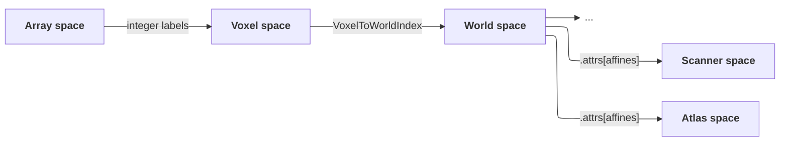

# The VoxelData Model

**VoxelData** is ConfUSIus's canonical
[DataArray](https://docs.xarray.dev/en/stable/getting-started-guide/why-xarray.html#core-data-structures)
model for any spatially referenced voxel array—beamformed IQ and fUSI recordings, atlas
volumes, decomposition component maps, displacement fields, and anything else gridded in
space.

A **VoxelData array** is a DataArray that satisfies the following requirements:

- native voxel dims `k`/`j`/`i` (integer coordinates), always last and always present,
  optionally preceded by `pose` (integer coordinates), `time` (floating coordinates),
  and any number of extra non-spatial dims (PCA/ICA components, stacked masks, etc.);
- a single
  [**`VoxelToWorldIndex`**](https://docs.xarray.dev/en/stable/user-guide/indexing.html)
  attached to the world coordinates `z`/`y`/`x`, which it derives from `k`/`j`/`i`
  through either one voxel-to-world affine transformation shared by the whole DataArray
  or stacked affine transformations with one entry per `pose`;
- required metadata: `units` on each world coordinate, plus—whenever `time` is
  present—`units`, `volume_acquisition_reference`, and `volume_acquisition_duration`
  on `time`:

| Attribute | Lives on | Meaning |
|---|---|---|
| `units` | `x`/`y`/`z`/`time` | Physical unit of the coordinate values (`"mm"` and `"s"` are typical). |
| `volume_acquisition_reference` | `time` | Which point of the acquisition window each `time` value marks: `"start"`, `"center"`, or `"end"`. |
| `volume_acquisition_duration` | `time` | Duration to acquire the whole `(k, j, i)` grid, in the same units as `time`—one whole volume when there's no `pose` dim, one pose's own volume when there is (see [Unconsolidated Multi-Pose Data](#unconsolidated-multi-pose-data)). |

A pose-dependent array may also carry a 2D `time` coordinate with shape `(time, pose)`,
recording each pose's own acquisition timestamps directly. Like pose-dependent world
coordinates, this requires selecting a scalar `pose` before label-based selection on
`time`.

[`create_voxeldata`][confusius.xarray.create_voxeldata] builds a VoxelData array
satisfying all of this from raw data, and
[`validate_voxeldata`][confusius.validation.validate_voxeldata] checks an existing DataArray
against it. [`ensure_voxeldata`][confusius.validation.ensure_voxeldata] additionally
canonicalizes the DataArray first—reordering dimensions to `(...extra, time, pose, k,
j, i)`, restoring a voxel dimension collapsed to a scalar coordinate by a prior
`.isel()`, and filling in missing `time` metadata with sensible defaults—before
validating. ConfUSIus functions that expect a VoxelData array call `ensure_voxeldata`
on their input.

See [Working with Xarray](xarray.md) for the accessor API that the VoxelData model
exposes.

## Temporal Conventions

The `time` coordinate marks when each volume was acquired, in the units named by its
`units` attribute (seconds, typically). Because a volume is acquired over a nonzero
window rather than instantaneously, `time` alone doesn't say which point of that window
the value refers to—`volume_acquisition_reference` disambiguates this: `"start"`,
`"center"`, or `"end"` of the acquisition window. `volume_acquisition_duration` gives
the window's length, in the same units as `time`. Together, these three attributes let
downstream code (e.g. GLM HRF convolution) reconstruct the exact acquisition window of
every volume rather than treating `time` as an instantaneous sample.

The rest of this section covers how these definitions adapt for [multi-pose
data](multipose.md), where poses making up one volume are swept through sequentially
rather than acquired simultaneously.

### Unconsolidated Multi-Pose Data

While a DataArray still carries a `pose` dimension, `time` is pose-dependent with shape
`(time, pose)` instead of the plain 1D coordinate above: each pose's own real
acquisition timestamp, built by [`stack_poses`][confusius.multipose.stack_poses] or
returned directly by loaders, such as when loading Iconeus `4Dscan` recordings. In this
shape, `volume_acquisition_duration` and `volume_acquisition_reference` describe **one
pose's own `(k, j, i)` acquisition window**, not the time it takes to sweep through
every pose. Resolving a single real timestamp requires selecting a scalar `pose`
first, which reduces `time` back to the plain 1D case.

### Consolidated Multi-Pose Data

[`consolidate_poses`][confusius.multipose.consolidate_poses] merges `pose` into the
sweep voxel dimension the poses were stepped along (`k`, `j`, or `i`, detected
automatically), so the result has no `pose` dimension left. Two things happen to
timing:

- `time` becomes an ordinary whole-array 1D coordinate again, but
  `volume_acquisition_duration`/`volume_acquisition_reference` are recomputed to
  describe **the full sweep across every pose**—from the earliest pose's onset to the
  latest pose's offset—rather than one pose's window.
- Each slice's own real timestamp survives separately as a new **`slice_time`**
  coordinate, with dims `(time, <sweep_dim>)` (or a single dim when `time` is scalar or
  absent), inheriting the pre-consolidation `time`'s `volume_acquisition_duration`/
  `volume_acquisition_reference` (still describing one pose's window, unlike the
  recomputed `time` attributes above). `slice_time` requires the same three
  attributes as `time`—`units`, `volume_acquisition_reference`,
  `volume_acquisition_duration`—and
  [`ensure_voxeldata`][confusius.validation.ensure_voxeldata] fills in missing ones the
  same way, defaulting `volume_acquisition_duration` from the median consecutive gap
  between slices along `<sweep_dim>`.

Since `time.attrs["volume_acquisition_duration"]` is the time to acquire the whole
`(k, j, i)` volume, every one of its slices must have happened within that same
window: validation converts both `time` and `slice_time` to `"start"` reference and checks:

- that the first slice starts no earlier than the volume's onset,
- and that the last slice ends no later than the volume's offset.

This doesn't forbid overlap between consecutive *volumes*:
`time.attrs["volume_acquisition_duration"]` may exceed the spacing between `time`
values, e.g sliding-window beamformed IQ processing acquisition). It only constrains a
slice against its own volume's window.

### Slice Timing Correction

[`correct_slice_timings`][confusius.multipose.correct_slice_timings] uses `slice_time`
(or an unconsolidated pose-dependent `time`) to resample each slice's or pose's time
series onto the shared, whole-array `time` reference—working on both unconsolidated and
consolidated data. See the [Multi-Pose Imaging guide](multipose.md#pose-consolidation)
for a full example.

## Spatial Conventions

ConfUSIus works with four kinds of coordinate systems:

- the **array space**, the dense, zero-based array position along each spatial
  dimension,
- the **voxel space**, the `k`/`j`/`i` coordinate labels attached to the underlying
  array storage (in dimension order `(k, j, i)`—see [Dimension
  Ordering](#dimension-ordering-time-pose-k-j-i) below), coinciding with array space
  only when voxel labels themselves start at `0` and increase by `1`,
- the **world space**, derived from voxel space through the DataArray's voxel-to-world
  affine transformation(s) and exposed as the coordinates `x`/`y`/`z`,
- and any number of **reference spaces** (atlas, scanner, etc.) linked to the world
  space through affine transforms stored in `attrs["affines"]`.

For most recordings, one voxel-to-world affine defines one world grid for the whole
DataArray. Multi-pose acquisitions are the main exception: they carry one affine per
`pose`, so `x`/`y`/`z` become pose-dependent coordinates and a scalar `pose` selection is
required before selecting by world coordinate.

Each space feeds the next—array position gets a voxel label, a voxel label gets a
world coordinate, and a world coordinate can reach any number of reference spaces:



### Dimension Ordering: `(..., time, pose, k, j, i)`

Every ConfUSIus DataArray that represents a fUSI recording uses the dimension order
`(..., time, pose, k, j, i)`, where:

| Dimension | Typical probe axis | Typical size |
|---|---|---|
| `...` | Any extra dimensions |  |
| `time` | Acquisition time | Thousands |
| `pose` | Probe poses | Tens |
| `k` | Elevation (stacking direction) | One to tens |
| `j` | Axial / depth | Tens to hundreds |
| `i` | Lateral | Tens to hundreds |

!!! tip "Dimension ordering is mostly transparent in Xarray"
    Users familiar with neuroimaging may be more accustomed to spatiotemporal
    conventions like `(i, j, k, time)`. Thankfully, Xarray makes dimension ordering
    largely transparent in practice: you can always refer to dimensions by name and in
    any order (e.g. `data.mean("time")`, `data.sel(x=4.54, y=-2.48, z=0.0)`) rather than
    by axis index, so you won't have to remember the order of the dimensions. For
    multi-pose arrays, select a scalar `pose` first before slicing in world space, e.g.
    `data.isel(pose=0).sel(x=4.54, y=-2.48, z=0.0)`.

This ordering is motivated by several considerations.

- **Equivalence with NIfTI:** NIfTI stores arrays in column-major (Fortran) order as
  `(i, j, k, time)`. Transposing to the more Pythonic row-major (C) order is a zero-copy
  operation that yields `(time, k, j, i)`.
- **Memory layout for volume-wise processing:** In row-major order the last axes are
  contiguous in memory, so `data[t]` (a single spatial volume) is a contiguous block,
  which is the natural unit of work for IQ processing, motion correction, and similar
  operations.
- **Statistical analysis convention:** After spatial processing, fUSI data is typically
  reshaped to `(time, space)` for statistical analysis. This is `data.stack(space=["k",
  "j", "i"])` in Xarray, matching the standard `(samples, features)` convention of
  [scikit-learn](https://scikit-learn.org/stable/) and
  [statsmodels](https://www.statsmodels.org/stable/index.html).
- **Alignment with neuroanatomical atlases:** For typical coronal preclinical fUSI
  recordings, `(k, j, i) = (elevation, axial/depth, lateral)` maps to
  `(antero-posterior, superior-inferior, left-right)`, which is the same orientation as
  [BrainGlobe](https://brainglobe.info) atlases (e.g. Allen CCFv3).
- **Visualization:** Most visualization tools (e.g. napari) expect the last two axes to
  be the display axes of a volume. Plotting a `(time, k, j, i)` array directly would
  yield a `(j, i)` slice with `time` and `k` sliders, correctly oriented for display.

### Array Space

The array space is the dense, zero-based position along each spatial dimension: position
`0` is always the array's first stored element, position `dim_size - 1` its last, and
every position in between is contiguous. In Xarray, `.isel` indexes by array position.
If you're used to NumPy, think of array space as the "axis index" of each dimension, for
example `data[0, 0, 0]` is the first voxel in array space, `data[-1, -1, -1]` the last.

### Voxel Space

Voxel space is the DataArray's `k`/`j`/`i` coordinate labels—indexed by label with
`.sel` in Xarray. Labels coincide with array space for a freshly built DataArray, but
the two diverge once a DataArray is cropped or strided from a larger one:

```pycon
>>> cropped = data.isel(i=slice(3, 6))
>>> cropped.coords["i"].values
array([3, 4, 5])
>>> cropped.isel(i=0).coords["i"].item()  # Array position 0's label.
3
>>> cropped.sel(i=3).coords["i"].item()   # The voxel labeled 3.
3
```

Use [`reindex_voxels`][confusius.xarray.reindex_voxels] to rebase voxel labels back to
dense array-space positions—see [Rebasing voxel coordinates to dense
positions](xarray.md#rebasing-voxel-coordinates-to-dense-positions) in Working with
Xarray.

### World Space

The world space is defined by the DataArray's voxel-to-world affine transformation (or
transformations, for multi-pose data) contained in the `VoxelToWorldIndex` and exposed
as coordinates `x`, `y`, `z`. For ordinary single-pose data these coordinates are arrays
with shape `(k, j, i)`. For multi-pose data they are pose-dependent with shape `(pose,
k, j, i)`, so selecting in world space requires a scalar `pose` first. The unit of the
coordinates is stored in the `units` attribute of each coordinate array; millimeters are
the usual default for fUSI recordings (e.g.
[`create_voxeldata`][confusius.xarray.create_voxeldata]'s default).

!!! warning "Units are not enforced"
    ConfUSIus does not check or convert between units across its APIs—`units` is
    metadata only. We plan to make the data model more unit-aware in the future.

World space is not tied to any one physical space—it's whatever space the DataArray's
voxel-to-world affine currently encodes, and that changes over the course of a pipeline.
A freshly loaded recording is typically expressed in scanner space: the space of the
first acquired probe pose, with origin at the probe surface and axes along lateral,
depth, and elevation. Once the data is resampled or registered, world space becomes
whatever space that operation targeted instead: an atlas template (e.g. Allen CCFv3),
another recording's grid, or any other space you choose.

World coordinates are set when attaching a `VoxelToWorldIndex` to the DataArray.
Different loaders derive them in different ways:

- **EchoFrame**: Lateral and axial coordinates are read from the acquisition metadata
  file.
- **AUTC**: Lateral and axial coordinates are supplied by the user as parameters to the
  conversion function. If coordinates are omitted, ConfUSIus falls back to bare voxel
  indices and emits a warning.
- **Iconeus SCAN**: Coordinates are derived from the `voxelsToProbe` affine embedded in
  the SCAN file. The axial coordinate (`y`) is sign-flipped so that it is always
  positive and increases with depth.
- **NIfTI**: Coordinates are derived from the translation and scale components of the
  "best" affine transformation found in the file header, or from whichever one
  [`load_nifti`][confusius.io.load_nifti]'s `coordinate_affine` argument selects
  explicitly.

!!! tip "The "best" NIfTI affine"
    NIfTI files can store two affine transforms in their header: `qform` and a
    `sform`, each with an associated integer code indicating whether the affine is
    valid (`code > 0`) and which space it points to.

    - `qform` cannot contain shears and is typically used to encode transforms from
      voxel space to scanner space. 
    - `sform` can be any arbitrary affine transformation and is typically used to encode
      transforms from voxel space to "standard" reference spaces, such as a recording's
      world space or an atlas space.

    By default, ConfUSIus follows the [same logic as
    NiBabel](https://nipy.org/nibabel/nifti_images.html#choosing-the-image-affine): if
    `sform_code > 0` the `sform` is used to define the world coordinates; otherwise, if
    `qform_code > 0` the `qform` is used. If both codes are zero a warning is emitted
    and coordinates fall back to a diagonal affine built from the NIfTI `pixdim` field.
    Pass `coordinate_affine="sform"`/`"qform"` to force one explicitly.

Hand-constructed DataArrays get whatever voxel-to-world affine the user provides via
[`create_voxeldata`][confusius.xarray.create_voxeldata].

#### Voxel-to-World Affine

The voxel-to-world affine itself is a `(4, 4)` homogeneous matrix (or a `(pose, 4, 4)`
stack for multi-pose data) mapping `(k, j, i)` voxel-space coordinate *labels* to `(z,
y, x)` world-space coordinate values:

```
[z, y, x, 1] = voxel_to_world @ [k_label, j_label, i_label, 1]
```

The voxel-to-world affine can be read with
[`.fusi.affine.voxel_to_world`][confusius.xarray.FUSIAffineAccessor.voxel_to_world], or
replaced outright with
[`.fusi.affine.set_voxel_to_world`][confusius.xarray.FUSIAffineAccessor.set_voxel_to_world].

That raw mapping is rarely what you want directly, though: most code that consumes
world-space geometry thinks in [array space](#array-space), not in whatever labels the
`k`/`j`/`i` coordinates happen to carry after upstream cropping or striding. See [Origin,
Spacing, Direction](#origin-spacing-direction) below for the array-space equivalent.

If you specifically need the dense-position affine that packages like NiBabel or the
NIfTI format expect, call [`reindex_voxels`][confusius.xarray.reindex_voxels] first: it
rebases `k`/`j`/`i` to the array space and updates `voxel_to_world` to match, so the
affine you then read off directly maps dense array positions instead of labels.

#### Origin, Spacing, Direction

[`.fusi.origin`][confusius.xarray.FUSIAccessor.origin],
[`.fusi.spacing`][confusius.xarray.FUSIAccessor.spacing], and
[`.fusi.direction`][confusius.xarray.FUSIAccessor.direction] (see [Global
Helpers](xarray.md#global-helpers) in Working with Xarray) describe the same
voxel-to-world affine, but anchored to array space rather than voxel labels:

- **origin**: world position of array space's origin, `(0, ..., 0)`. Keyed by world
  axis (`z`/`y`/`x`).
- **spacing**: world distance covered by one array-space step. Keyed by voxel axis
  (`k`/`j`/`i`).
- **direction**: `(3, 3)` matrix of unit world-space direction vectors, one per
  array-space axis: columns are voxel axes (`k`/`j`/`i`), rows are world axes
  (`z`/`y`/`x`). Direction flips sign on an axis whose labels run descending (e.g.
  after `.isel(dim=slice(None, None, -1))`).

For example, if `k`'s labels are `[0, 2, 4]` (every other voxel was kept, e.g. by
`.isel(k=slice(None, None, 2))`) and the affine's per-label scale along `k` is `0.1`,
then `data.fusi.spacing["k"]` is `0.2`, not `0.1`: consecutive *sampled* labels are two
label-units apart. Together, `origin`/`spacing`/`direction` reconstruct world
coordinates from array position rather than from labels:

```
world = origin + direction @ (spacing * array_position)
```

### Reference Spaces

ConfUSIus stores affine transformations relating the DataArray's current world space to
any number of other named spaces in `attrs["affines"]`, a dictionary keyed by affine
name. Reference spaces can be an atlas space, a scanner or lab space, another
recording's world space, or a space the data has already moved away from (e.g. the raw
probe-relative space a recording started in).

A space counts as a "reference space" rather than *the* world space only because
reaching it currently takes an affine.
[`.fusi.affine.apply`][confusius.xarray.FUSIAffineAccessor.apply] can turn any one of
them into the world space itself (see [Switching World
Spaces](#switching-world-spaces)). Each reference space is stored in `attrs["affines"]`
as a homogeneous affine matrix in `(z, y, x)` convention that maps a world-space point
to the corresponding point in the reference space. Most are plain `(4, 4)` matrices;
for multi-pose data they may also be stacked `(pose, 4, 4)` affines with one entry per
pose.

Several loaders populate `da.attrs["affines"]` automatically:

- **NIfTI**: The world space is whichever affine (`sform` or `qform`) was selected—it
  never appears in `attrs["affines"]` itself. When the other one is also valid, it is
  stored as `"world_to_sform"` or `"world_to_qform"` accordingly, so the world space can
  be switched between the two. [`save_nifti`][confusius.io.save_nifti] can write any
  named affine in `attrs["affines"]` back to the header via its `qform=`/`sform=`
  arguments, defaulting to `"world_to_qform"`/`"world_to_sform"` when not specified.
- **Iconeus SCAN**: [`load_scan`][confusius.io.load_scan] stores a
  `"world_to_lab"` affine mapping ConfUSIus world coordinates to the Iconeus lab
  coordinate system. For multi-pose acquisitions (`3Dscan`, `4Dscan`), one affine per
  pose is stored, with shape `(pose, 4, 4)`.

Registration transforms are handled separately from `attrs["affines"]`.
[`register_volume`][confusius.registration.register_volume] returns the estimated
transform explicitly but does not store automatically in `attrs["affines"]`.

!!! question "Why store affines as world → reference instead of voxel → reference?"
    A voxel → reference affine breaks the moment the voxel space is reindexed—via
    [`reindex_voxels`][confusius.xarray.reindex_voxels] or when saving to NIfTI. A world
    → reference affine doesn't have this problem: it operates on world coordinate
    values, which stay physically correct through reindexing.
    [`save_nifti`][confusius.io.save_nifti] reconstructs the voxel → reference NIfTI
    affine it needs by composing the stored world → reference affine with the
    DataArray's current voxel → world affine at save time.

## Switching World Spaces

To switch a DataArray's world space to one of its reference spaces, apply the affine
that relates them: [`.fusi.affine.apply`][confusius.xarray.FUSIAffineAccessor.apply]
takes a `(4, 4)` affine (or a key into `attrs["affines"]`) and re-expresses the
DataArray's world coordinates in that space, which becomes the new world space. For
multi-pose data, applying a single affine broadcasts it over every pose, while a
stacked affine is applied pose-by-pose.

Take the `sform`/`qform` example from [Reference Spaces](#reference-spaces). A NIfTI
file with `sform_code > 0` anchors its world space to the `sform` space, and the
relationship to the `qform` space (a 90° rotation in the `(z, y)` plane, here) is
carried on the `world_to_qform` affine attribute:

```pycon
>>> da.coords["z"].values.flatten()
array([-1., -1., -1., -1.,  0.,  0.,  0.,  0.,  1.,  1.,  1.,  1.])
>>> da.coords["y"].values.flatten()
array([0.5, 1.5, 2.5, 3.5, 0.5, 1.5, 2.5, 3.5, 0.5, 1.5, 2.5, 3.5])
>>> da.attrs["affines"]["world_to_qform"]
array([[ 0., -1.,  0.,  0.],
       [ 1.,  0.,  0.,  0.],
       [ 0.,  0.,  1.,  0.],
       [ 0.,  0.,  0.,  1.]])
```

Applying `world_to_qform` absorbs the rotation into the DataArray's voxel-to-world
affine, and the derived `z`/`y` coordinates change accordingly. The `qform` space
becomes the new world space, and `"world_to_qform"` is dropped from the result:
applying a stored affine by its own key re-anchors the world space to exactly that
space, so the entry would carry no information any more.

```pycon
>>> da_q = da.fusi.affine.apply("world_to_qform")
>>> da_q.coords["z"].values.flatten()
array([-0.5, -1.5, -2.5, -3.5, -0.5, -1.5, -2.5, -3.5, -0.5, -1.5, -2.5,
       -3.5])
>>> da_q.coords["y"].values.flatten()
array([-1., -1., -1., -1.,  0.,  0.,  0.,  0.,  1.,  1.,  1.,  1.])
>>> da_q.attrs["affines"]
{}
```

See [Affine Transforms](xarray.md#affine-transforms) in Working with Xarray for
the rest of the `.fusi.affine` API (`voxel_to_world`, `set_voxel_to_world`, `to`).
